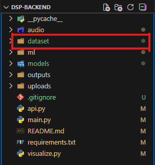

# ADPIS - Audio Digital Processing & Intelligence System Backend

Backend cho dự án cuối kỳ môn **Xử lý Tín hiệu Số (DSP501)**.  
Hệ thống chịu trách nhiệm **xử lý tín hiệu số (DSP)**, **phân loại dòng nhạc** và **cung cấp API** cho frontend giao tiếp.

---

## 1. Chức năng chính

### 🎚️ Audio Equalizer
- Xử lý Equalizer đa băng theo các tần số
- Áp dụng cho file audio `.wav`, `.mp3`
- Hỗ trợ xử lý và phát **Equalizer realtime từ microphone**

---

### 📊 Visualization
- Hiển thị dạng sóng tín hiệu (Waveform)
- Hiển thị phổ tần số (Frequency Spectrum)
- So sánh tín hiệu **trước và sau khi áp dụng Equalizer**

---

### 🎵 Music Genre Classification
- Phân loại dòng nhạc bằng mô hình **Machine Learning**
- Trích xuất đặc trưng từ tín hiệu audio
- Trả về:
  - Nhãn thể loại nhạc
  - Độ tin cậy của dự đoán

---

### 🌐 Backend API
- Cung cấp **REST API** cho frontend (FastAPI)
- Hỗ trợ:
  - Upload file audio
  - Thu âm audio
  - Xử lý Equalizer
  - Phân loại dòng nhạc

---

## 2. Cấu trúc thư mục

```text
backend/
│
├── dataset/                # Dataset dùng để train và test
│
├── audio/                  # DSP core
│   ├── audio_io.py         # Đọc / ghi file audio
│   ├── filters.py          # Thiết kế bộ lọc / chia băng tần
│   ├── equalizer.py        # Module Equalizer
│   └── realtime.py         # Xử lý Equalizer realtime (microphone)
│
├── ml/                     # Machine Learning
│   ├── features.py         # Trích xuất đặc trưng
│   ├── train.py            # Train model (offline)
│   └── predict.py          # Dự đoán dòng nhạc
│
├── visualize.py             # Waveform & FFT Spectrum
├── api.py                   # FastAPI server
├── models/
│   └── genre_model.pkl      # Model đã train
│
├── main.py                  # Demo chạy local
├── requirements.txt
└── README.md
````

---

## 3. Yêu cầu hệ thống

* Python **3.10 – 3.12** (khuyến nghị sử dụng Conda)
* Hệ điều hành: Windows / macOS / Linux

---

## 4. Hướng dẫn cài đặt & chạy

### 4.1 Kích hoạt môi trường Conda (nếu có)

```bash
conda activate msa
```

Kiểm tra phiên bản Python:

```bash
python --version
```

---

### 4.2 Cài đặt thư viện và chuẩn bị dataset

Cài đặt các thư viện cần thiết:

```bash
pip install -r requirements.txt
```

Chuẩn bị dataset:

1. Tải dataset từ Google Drive: [Dataset DSP501](https://drive.google.com/drive/folders/1HPN7VpTUpykCEGIZdmQAKX6y6MD5vwkf?usp=sharing)
2. Giải nén dataset
3. Sao chép toàn bộ thư mục dataset vào **thư mục gốc của project** (`backend/`).


### 4.3 Chạy demo backend

```bash
python main.py
```

Chương trình sẽ:

* Load file audio mẫu
* Áp dụng Equalizer
* Hiển thị phổ tần số trước và sau xử lý
* Xuất file audio sau khi xử lý

---

## 5. Chạy API Backend

```bash
uvicorn api:app --reload
```

Mở trình duyệt tại:

```
http://localhost:8000/docs
```

Swagger UI sẽ hiển thị các API:

* `/equalizer`
* `/classify`

---

## 6. Docker Setup (Recommended)

### 6.1 Build và chạy với Docker Compose

Cách dễ nhất để chạy hệ thống:

```bash
# Build và chạy container
docker-compose up --build

# Chạy ở chế độ background
docker-compose up -d --build
```

### 6.2 Build và chạy với Docker thủ công

```bash
# Build image
docker build -t dsp-backend .

# Run container
docker run -p 8000:8000 -v $(pwd)/dataset:/app/dataset -v $(pwd)/models:/app/models dsp-backend
```

### 6.3 Lợi ích của Docker

- **Môi trường nhất quán**: Đảm bảo chạy được trên mọi máy
- **Dễ cài đặt**: Không cần cài đặt Python và các thư viện
- **Cô lập**: Không ảnh hưởng đến hệ thống hiện tại
- **Dễ deploy**: Có thể deploy lên production dễ dàng

Sau khi chạy Docker, truy cập:
```
http://localhost:8000/docs
```

---

## 7. Ghi chú

* Hệ thống sử dụng **thiết bị audio mặc định** của máy
* Không sử dụng cơ sở dữ liệu
* Mô hình Machine Learning được lưu dưới dạng file `.pkl`
* Backend **chỉ xử lý DSP và ML**, không xử lý giao diện
* **Khuyến nghị**: Sử dụng Docker để tránh các vấn đề về dependencies

---

## 8. Thư viện sử dụng

* numpy
* scipy
* librosa
* soundfile
* matplotlib
* scikit-learn
* joblib
* fastapi
* uvicorn
* sounddevice
* python-multipart

---

## 9. Tác giả

1. Nguyễn Văn Tú
2. Bùi Ngọc Bảo Trân
3. Lê Ngọc Hiếu
4. Lê Bảo Nguyên
